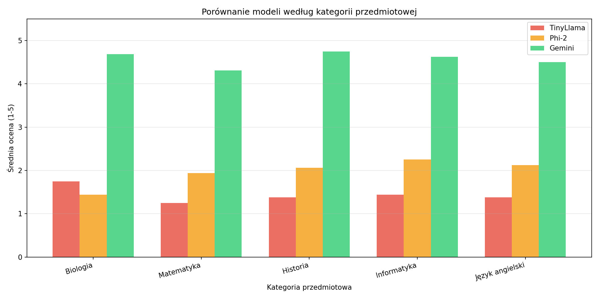

# 📊 LLM Comparison for Educational Content Generation

## 📌 Opis projektu

Projekt został zrealizowany w ramach pracy magisterskiej pt.:

**„Wykorzystanie dużych modeli językowych (LLM) do generowania treści edukacyjnych"**

Celem projektu jest porównanie jakości materiałów edukacyjnych generowanych przez trzy modele językowe: TinyLlama, Phi-2 oraz Gemini, w kontekście ich przydatności dydaktycznej w języku polskim.

---

## 🤖 Wykorzystane modele

| Model | Typ | Parametry |
|-------|-----|-----------|
| TinyLlama 1.1B-Chat-v1.0 | Lokalny (HuggingFace) | 1,1 mld |
| Phi-2 (microsoft/phi-2) | Lokalny (HuggingFace) | 2,7 mld |
| Gemini 2.5 Flash | API Google | Komercyjny |

---

## 🎯 Cel badań

Porównanie modeli pod względem czterech kryteriów jakości:

- **Poprawność** — merytoryczna poprawność treści
- **Język** — jakość gramatyczna i stylistyczna
- **Poziom** — dopasowanie poziomu trudności do odbiorcy
- **Przydatność** — praktyczna przydatność do użycia w nauczaniu

---

## 🧪 Metodologia

### Prompt systemowy
Model pełni rolę doświadczonego nauczyciela z wieloletnią praktyką dydaktyczną, tworzącego wysokiej jakości materiały edukacyjne dostosowane do poziomu ucznia.

### Prompty testowe (20 promptów, 5 kategorii przedmiotowych)

| Kategoria | Liczba promptów | Typy zadań |
|-----------|----------------|------------|
| Biologia | 4 | Wyjaśnienie, pytania testowe, materiał z zadaniami, streszczenie |
| Matematyka | 4 | Wyjaśnienie, zadania z odpowiedziami, materiał dydaktyczny, streszczenie |
| Historia | 4 | Wyjaśnienie, pytania testowe, materiał z zadaniami, streszczenie |
| Informatyka | 4 | Wyjaśnienie, pytania testowe, materiał z kodem, streszczenie |
| Język angielski | 4 | Wyjaśnienie, ćwiczenia gramatyczne, materiał dydaktyczny, streszczenie |

### Ocena
- Łącznie oceniono **59 odpowiedzi** (20 × TinyLlama, 20 × Phi-2, 19 × Gemini)
- Każda odpowiedź oceniana przez **dwóch niezależnych oceniających**
- Skala 1–5 z operacyjnymi definicjami każdego punktu
- Zgodność między oceniającymi: **Cohen's κ = 0,192**
- Istotność różnic: **test Kruskala-Wallisa** (p < 0,0001 dla wszystkich kryteriów)

---

## 📊 Wyniki

### Średnie oceny modeli

| Model | Poprawność M (SD) | Język M (SD) | Poziom M (SD) | Przydatność M (SD) | Ogólna M |
|-------|-------------------|--------------|---------------|-------------------|----------|
| TinyLlama | 1,30 (0,47) | 1,45 (0,51) | 1,80 (0,52) | 1,20 (0,41) | **1,44** |
| Phi-2 | 2,00 (0,32) | 1,75 (0,44) | 2,10 (0,72) | 2,00 (0,65) | **1,96** |
| Gemini* | 4,74 (0,56) | 4,68 (0,48) | 4,32 (0,48) | 4,58 (0,51) | **4,58** |

*Gemini niedostępny podczas Promptu 19 (błąd 429) — średnia obliczona na podstawie 19 promptów*

### Wyniki testu Kruskala-Wallisa

| Kryterium | H | p |
|-----------|---|---|
| Poprawność | 48,804 | < 0,0001 |
| Język | 43,517 | < 0,0001 |
| Poziom | 42,303 | < 0,0001 |
| Przydatność | 46,727 | < 0,0001 |

### Wyniki według kategorii przedmiotowych (Gemini)

| Kategoria | Średnia |
|-----------|---------|
| Historia | 4,75 |
| Biologia | 4,69 |
| Informatyka | 4,62 |
| Język angielski | 4,50 |
| Matematyka | 4,31 |

### Kluczowe obserwacje

- Gemini jednoznacznie dominuje we wszystkich kryteriach jakości
- Różnica między Gemini (M=4,58) a TinyLlama (M=1,44) wynosi **3,14 punktu**
- TinyLlama i Phi-2 wykazują podobnie niskie wyniki — różnica wynosi tylko 0,52 pkt
- Modele lokalne nie są zoptymalizowane dla języka polskiego — główna przyczyna niskich wyników
- Gemini najlepiej sprawdza się w kategorii Historia (M=4,75) i Biologia (M=4,69)

---

## 📈 Wizualizacja

### Wykres liniowy — średnie oceny według kryteriów


### Wykres słupkowy — porównanie według kategorii przedmiotowych


### Wykres radarowy — porównanie według kryteriów


---

## ⚙️ Technologie

- **Python** — język programowania
- **PyCharm** — środowisko programistyczne
- **Transformers (HuggingFace)** — lokalne modele TinyLlama i Phi-2
- **Google Generative AI SDK** — dostęp do Gemini API
- **Matplotlib** — wizualizacja wyników
- **SciPy** — test Kruskala-Wallisa
- **CSV** — zapis wyników
- **python-dotenv** — zarządzanie kluczem API

---

## 🚀 Uruchomienie

### Wymagania
```bash
pip install transformers torch google-generativeai matplotlib python-dotenv scipy
```

### Konfiguracja
Utwórz plik `.env` i dodaj klucz API:
```
GEMINI_API_KEY=twój_klucz_api
```

### Uruchomienie eksperymentu
```bash
python main.py
```

### Obliczenie Cohen's kappa
```bash
python calculate_kappa.py
```

### Generowanie aneksu
```bash
python generate_aneks.py
```

---

## ⚠️ Ograniczenia

- Cohen's κ = 0,192 wskazuje na minimalną zgodność między oceniającymi
- Każda kategoria reprezentowana przez tylko 4 prompty
- Gemini niedostępny podczas Promptu 19 (błąd API 429)
- Modele lokalne nie były optymalizowane dla języka polskiego
- Szybki rozwój technologii LLM może wpłynąć na powtarzalność wyników

---

## 📁 Struktura projektu

```
projekt/
├── main.py                        # Główny skrypt eksperymentu
├── calculate_kappa.py             # Obliczenie Cohen's kappa
├── generate_aneks.py              # Generowanie aneksu
├── .env                           # Klucz API (nie dodawaj do git!)
├── results.csv                    # Wyniki ocen
├── final_wykres.png               # Wykres liniowy
├── wykres_kategorie.png           # Wykres słupkowy
├── radar_chart.png                # Wykres radarowy
├── ocena_drugi_oceniajacy.txt     # Dokument dla drugiego oceniającego
├── ZALACZNIK_1_pelne_odpowiedzi.txt # Aneks z pełnymi odpowiedziami
└── answers/                       # Folder z odpowiedziami modeli
    ├── prompt_01_TinyLlama.txt
    ├── prompt_01_Phi-2.txt
    ├── prompt_01_Gemini.txt
    └── ...
```

---

## 📄 Pliki wynikowe

| Plik | Opis |
|------|------|
| `results.csv` | Oceny obu oceniających |
| `answers/` | Pełne odpowiedzi wszystkich modeli |
| `final_wykres.png` | Wykres liniowy średnich ocen |
| `wykres_kategorie.png` | Wykres słupkowy według kategorii |
| `radar_chart.png` | Wykres radarowy |
| `ZALACZNIK_1_pelne_odpowiedzi.txt` | Aneks do pracy magisterskiej |
