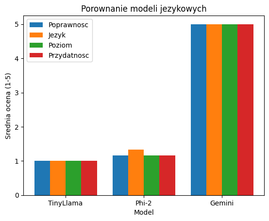
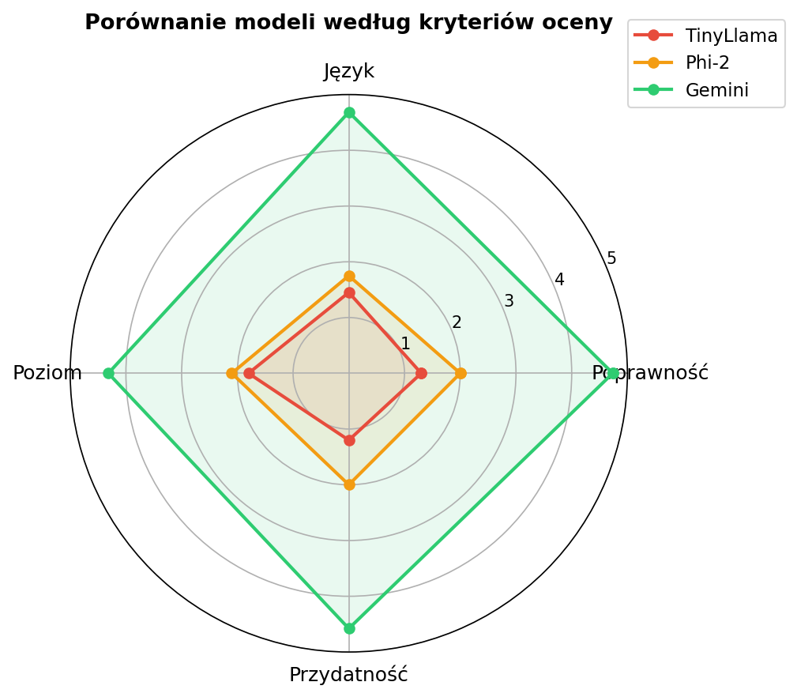

# 📊 LLM Comparison for Educational Content Generation

## 📌 Opis projektu

Projekt został zrealizowany w ramach pracy magisterskiej pt.:

**„Wykorzystanie dużych modeli językowych (LLM) do generowania treści edukacyjnych"**

Celem projektu jest porównanie jakości materiałów edukacyjnych generowanych przez trzy modele językowe: TinyLlama, Phi-2 oraz Gemini, w kontekście ich przydatności dydaktycznej.

---

## 🤖 Wykorzystane modele

| Model | Typ | Parametry |
|-------|-----|-----------|
| TinyLlama 1.1B | Lokalny (HuggingFace) | 1,1 mld |
| Phi-2 | Lokalny (HuggingFace) | 2,7 mld |
| Gemini 2.5 Flash | API Google | Komercyjny |

---

## 🎯 Cel badań

Porównanie modeli pod względem czterech kryteriów jakości:

- **Poprawność** — merytoryczna poprawność treści
- **Język** — jakość gramatyczna i stylistyczna
- **Poziom** — dopasowanie poziomu trudności do odbiorcy
- **Przydatność** — praktyczna przydatność do użycia w nauczaniu

---

## 🧪 Metodologia

### Prompt systemowy
Model pełni rolę doświadczonego nauczyciela z wieloletnią praktyką dydaktyczną, tworzącego wysokiej jakości materiały edukacyjne dostosowane do poziomu ucznia.

### Prompty testowe (5 promptów dot. fotosyntezy)

| Nr | Prompt | Typ zadania |
|----|--------|-------------|
| 1 | Wyjaśnij czym jest fotosynteza dla ucznia szkoły podstawowej | Wyjaśnienie pojęcia |
| 2 | Przygotuj zestaw 5 pytań testowych z biologii na temat fotosyntezy dla ucznia liceum | Pytania testowe |
| 3 | Stwórz krótki materiał dydaktyczny + 3 zadania + odpowiedzi na temat fotosyntezy | Materiał dydaktyczny |
| 4 | Wyjaśnij fotosyntezę prostym językiem z przykładem | Uproszczone wyjaśnienie |
| 5 | Napisz krótkie streszczenie fotosyntezy | Streszczenie |

### Ocena
Każda odpowiedź oceniana w skali 1–5 według czterech kryteriów z operacyjnymi definicjami każdego punktu skali.

---

## 📊 Wyniki

### Średnie oceny modeli

| Model | Poprawność | Język | Poziom | Przydatność | Ogólna średnia |
|-------|-----------|-------|--------|-------------|----------------|
| TinyLlama | 1,00 | 1,80 | 1,00 | 1,00 | **1,20** |
| Phi-2 | 1,00 | 2,00 | 1,40 | 1,20 | **1,40** |
| Gemini* | 4,50 | 4,25 | 3,75 | 4,00 | **4,13** |

*Gemini niedostępny podczas Promptu 4 (błąd 503) — średnia obliczona na podstawie 4 promptów*

### Kluczowe obserwacje

- Gemini jednoznacznie dominuje we wszystkich kryteriach jakości
- TinyLlama i Phi-2 wykazują podobnie niskie wyniki — różnica między nimi wynosi tylko 0,20 pkt
- Największa różnica między modelami dotyczy kryterium Poprawność (4,50 vs 1,00)
- Gemini najlepiej sprawdza się przy strukturyzowanych zadaniach — pytania testowe (średnia 4,75)

---

## 📈 Wizualizacja

### Wykres liniowy — średnie oceny


### Wykres radarowy — porównanie według kryteriów


---

## ⚙️ Technologie

- **Python** — język programowania
- **PyCharm** — środowisko programistyczne
- **Transformers (HuggingFace)** — lokalne modele TinyLlama i Phi-2
- **Google Generative AI SDK** — dostęp do Gemini API
- **Matplotlib** — wizualizacja wyników
- **CSV** — zapis wyników
- **python-dotenv** — zarządzanie kluczem API

---

## 🚀 Uruchomienie

### Wymagania
```bash
pip install transformers torch google-generativeai matplotlib python-dotenv
```

### Konfiguracja
Utwórz plik `.env` i dodaj klucz API:
### Uruchomienie
```bash
python main.py
```

---

## ⚠️ Ograniczenia

- Ocena przeprowadzona przez jednego oceniającego (autora badania)
- Wszystkie prompty dotyczyły jednego tematu (fotosynteza)
- Gemini niedostępny podczas jednego z promptów (błąd API 503)
- Modele lokalne nie były optymalizowane dla języka polskiego

---

## 📄 Pełne wyniki

Pełne odpowiedzi wszystkich modeli dostępne w folderze:

📁 `answers/`
